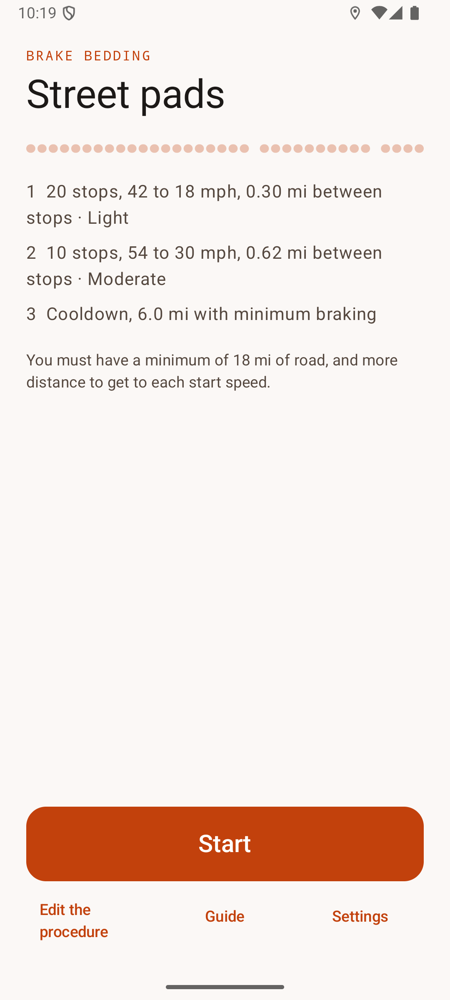
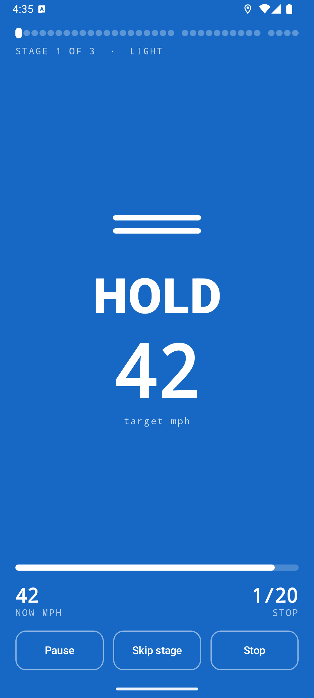
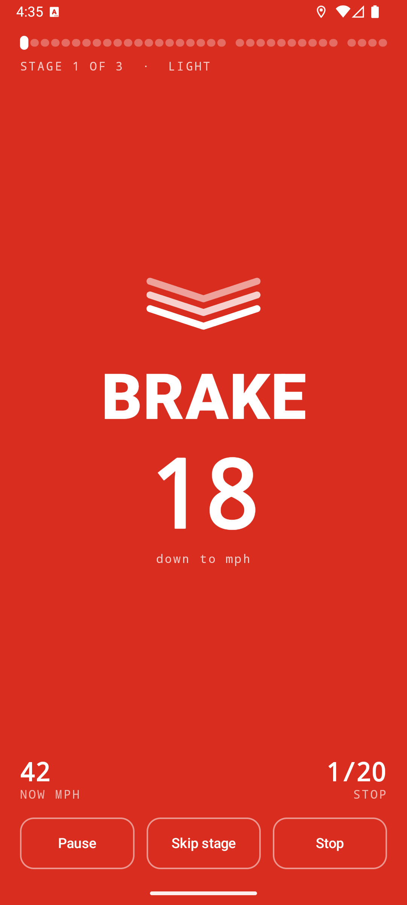
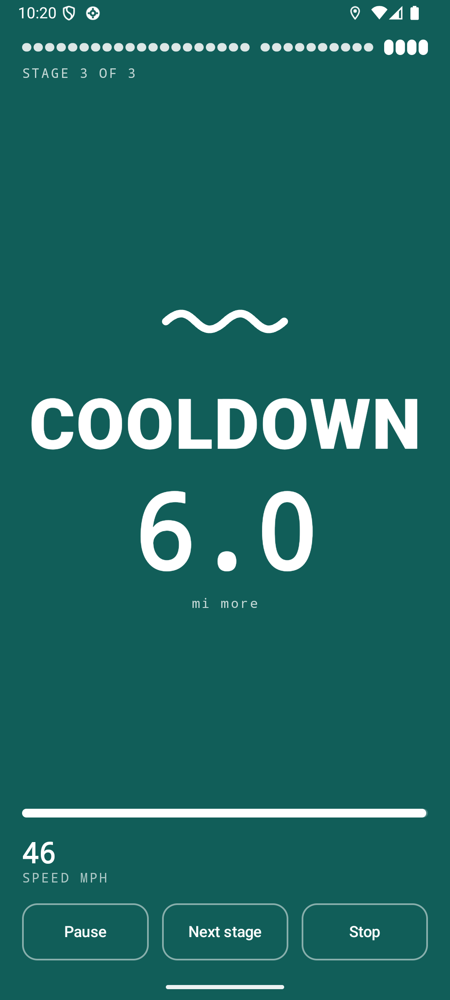
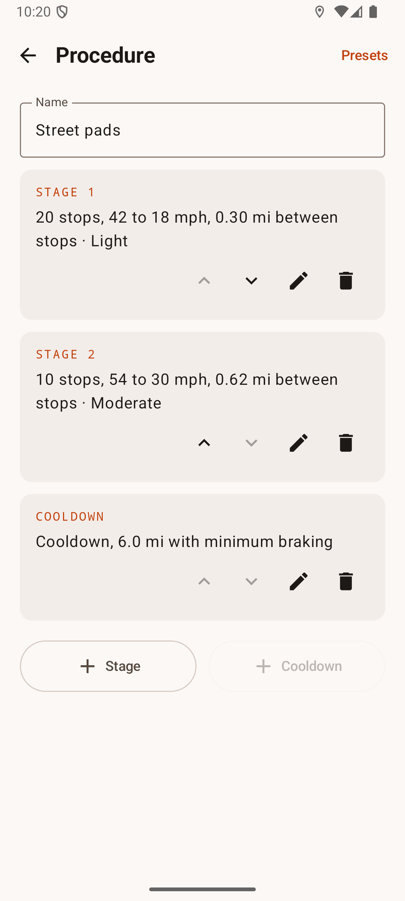
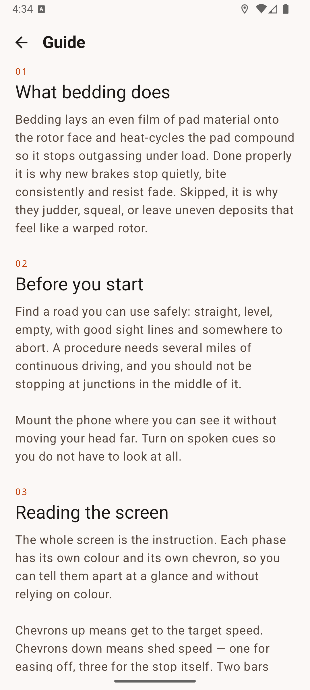

<p align="center">
  
</p>

<h1 align="center">Brake Bedding</h1>

<p align="center">
  <a href="https://github.com/nicglazkov/brake-bedding/actions/workflows/build.yml"></a>
  
  
  <a href="LICENSE"></a>
</p>

Brake Bedding is an app for Android and iOS. It helps you bed in new brake pads and
rotors. The app reads your speed from GPS. It shows and speaks each instruction at the
correct time. One Kotlin Multiplatform codebase supplies the two apps, so the two
platforms have the same engine, the same screens, and the same texts.

Brake bedding puts a thin, equal layer of pad material on the rotor surface. It also
heats the pads in controlled cycles. Correct bedding gives brakes that are quiet and
consistent. The procedure is not complex, but it is difficult to do from memory: many
stops from one speed to a lower speed, with a set distance between the stops.

<p align="center">
  
  
  
</p>
<p align="center">
  
  
  
</p>

## Functions

- The app reads your ground speed from GPS and shows the applicable instruction
- Each instruction has its own full-screen color. You can read it quickly from the
  driver seat
- The app can speak each instruction. Then it is not necessary to look at the screen
- Each instruction also has its own symbol. You do not identify an instruction only by
  its color
- A progress bar at the top shows the stops that remain
- The run continues when a call comes in or when the screen goes off. The instruction
  stays in the notification, with Pause and Stop controls
- You can edit the stages, start from three presets, and select mph or km/h

## Installation

### Android

1. Download `brake-bedding-<version>.apk` from the
   [latest release](https://github.com/nicglazkov/brake-bedding/releases/latest).
2. If the device asks for it, give your browser or file manager permission to install
   unknown apps.
3. Open the file to install the app.
4. Give the app access to your accurate location when it asks. This is the speed source.
   The app does not use other permissions to operate.

### iOS

The iOS app comes through TestFlight. The public TestFlight link will be in this
section when Apple completes the beta review. On iOS, the run instruction also shows
as a Live Activity on the Lock Screen and in the Dynamic Island, with Pause and Stop
buttons.

## Safety

**Do the procedure only on a road where it is safe.** The road must be straight, level,
and empty, with a clear view. You must have some miles of road without intersections.

- Obey the speed limits. If a stage specifies a speed that is too high for the road,
  decrease the speed in the stage editor.
- Do not stop the vehicle during a stop cycle. Do not hold the brake pedal when the
  brakes are hot and the vehicle does not move. This causes an unwanted layer of pad
  material on the rotor.
- Stop the procedure immediately if you get the smell of hot brakes, if the pedal
  becomes soft, or if the vehicle pulls to one side.
- Complete the cooldown before you park.

The app is a guide. It cannot see the road. You are responsible for the vehicle. The
instructions from the pad manufacturer have priority over this app. The presets are
usual procedures from the community, not manufacturer data. Because of this, you can
edit them.

## Operation

1. Open the app. Use the default preset, or push **Edit the procedure**.
2. For each stage, set the number of stops, the start speed, the target speed, the
   distance between the stops, and the brake force.
3. Keep a cooldown stage at the end. The app shows a message if there is no cooldown.
4. Go to your road, attach the phone, and push **Start**.

The instructions during a run:

| Instruction | Meaning |
|---|---|
| **INCREASE SPEED** (chevrons up) | Go to the start speed of the stage |
| **DECREASE SPEED** (one chevron down) | Your speed is too high for the stage |
| **HOLD SPEED** (two bars) | Stay at this speed until the bar is empty |
| **BRAKE** (three chevrons down) | Apply the brakes with the specified force. Release at the target speed |
| **DRIVE** (one bar) | Drive the set distance. Do not brake. The brakes become more cool |
| **COOLDOWN** (wave symbol) | Drive the cooldown distance with minimum braking |

**Pause** stops the procedure temporarily. **Next stage** goes to the subsequent stage
if your road is too short. **Stop** ends the run. If the GPS signal goes off, the run
stops until the signal is available again.

## How the app operates

The important part is `engine/BeddingEngine.kt`. It is a pure function, with no
platform imports, no timers, and no callbacks. It gets a state and an event, and it
returns the subsequent state. Because of this, a test can do a full run of thirty
stops in microseconds, without a device. The same tests run on the JVM and on the iOS
simulator.

```
SpeedSource ──▶ RunController ──▶ BeddingEngine ──▶ RunState ──▶ RunScreen (Compose)
 (GPS data)     (4 Hz timing,     (pure reducer)
                 signal checks)

shared/     the engine, the data layer, the screens, and the controller (common code)
androidApp/ the activity, the foreground service, and the Android resources
iosApp/     the Swift host, background location, and the Live Activity
```

Two design points:

- **Each timing step decreases the hold countdown by the duration of that step.** There
  is no scheduled callback and no concurrency in the run loop. Because of this, timer
  races are not possible.
- **The app keeps procedures in SI units.** It converts the values only for the
  display. When you change between mph and km/h, the procedure does not change.

The stages are a `@Serializable sealed interface` with one generated serializer for
write and read. Because of this, the stored form and the parsed form are always the
same.

## Build instructions

You must have JDK 17 or newer. The Gradle wrapper downloads the other components. The
iOS build also uses a Mac with Xcode 26 and xcodegen.

```bash
git clone https://github.com/nicglazkov/brake-bedding.git
cd brake-bedding

# Android
./gradlew :androidApp:assembleDebug   # The APK goes to androidApp/build/outputs/apk/debug/
./gradlew :shared:testAndroidHostTest # The common tests on the JVM

# iOS
./gradlew :shared:iosSimulatorArm64Test   # The common tests on the iOS simulator
cd iosApp && xcodegen generate            # Makes BrakeBedding.xcodeproj
# Then build the BrakeBedding scheme in Xcode, or with xcodebuild.
```

The minimum versions are Android 8.0 (API 26) and iOS 17. The Android app compiles
against API 37 and has a target of API 36.

### Release signing

The release build gets its signature data from a `keystore.properties` file in the root
of the repository. Git ignores this file. Do not commit it.

```properties
storeFile=/absolute/path/to/your.jks
storePassword=...
keyAlias=...
keyPassword=...
```

The project also builds without this file. Then the release APK has no signature. CI
operates in this condition. This shows that the build is possible without data that
only the maintainer has.

## Privacy

The app has no permission to use the network. The app reads your location from the GPS
receiver in the device. The app uses the location only for the speed calculation. The
location data stays on the device.

## Language

The text in the app and in this repository obeys ASD-STE100 (Simplified Technical
English) as much as possible without the licensed STE dictionary and a checker tool.

## License

Apache 2.0 — refer to [LICENSE](LICENSE).

## Disclaimer

The app comes as-is, without a warranty. You are responsible for your safety. Obey the
recommendations from your brake manufacturer.
